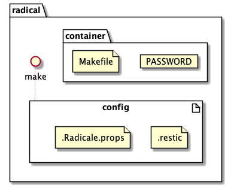
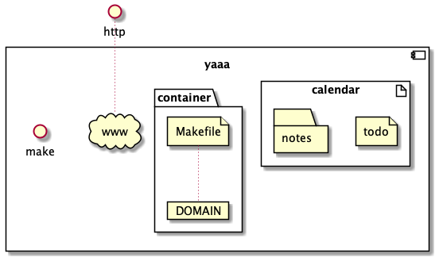
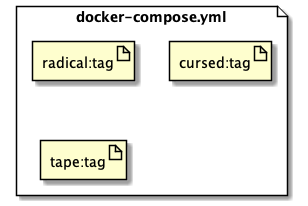
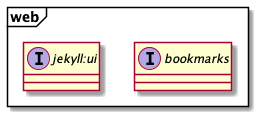
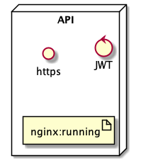
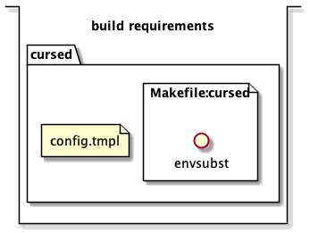

# Tape

this is a really buggy script for creating disk partitions to facilitate
disaster recovery

you can run

```shell
make -e DRIVE=/dev/diskX
```

you should see

```shell
/dev/diskX (external, physical):
   #:                       TYPE NAME                    SIZE       IDENTIFIER
   0:      GUID_partition_scheme                        *1.0 TB     disk5
   1:                        EFI EFI                     209.7 MB   disk5s1
   2:                  Apple_HFS macos                   12.4 GB    disk5s2
   3:       Microsoft Basic Data ubuntu                  24.0 GB    disk5s3
   4:                 Apple_APFS Container disk8         963.5 GB   disk5s4
```

at the time of writing this command will create a bootable installer for the
latest macos (assuming you've downloaded the installer)

```shell
 sudo /Applications/Install\ macOS\ Catalina.app/Contents/Resources/createinstallmedia --volume /Volumes/macos
```

Raspberrypi.org provides an application for flashing images

Restic is a useful tool for backups

Hence, flavors of `macOS` and `*nix` can be installed, while `restic` helps with
deduping etc


#### TODO

- [ ] set FS descriptions in yaml
- [ ] eventually this project is for maintaining a record of all work








